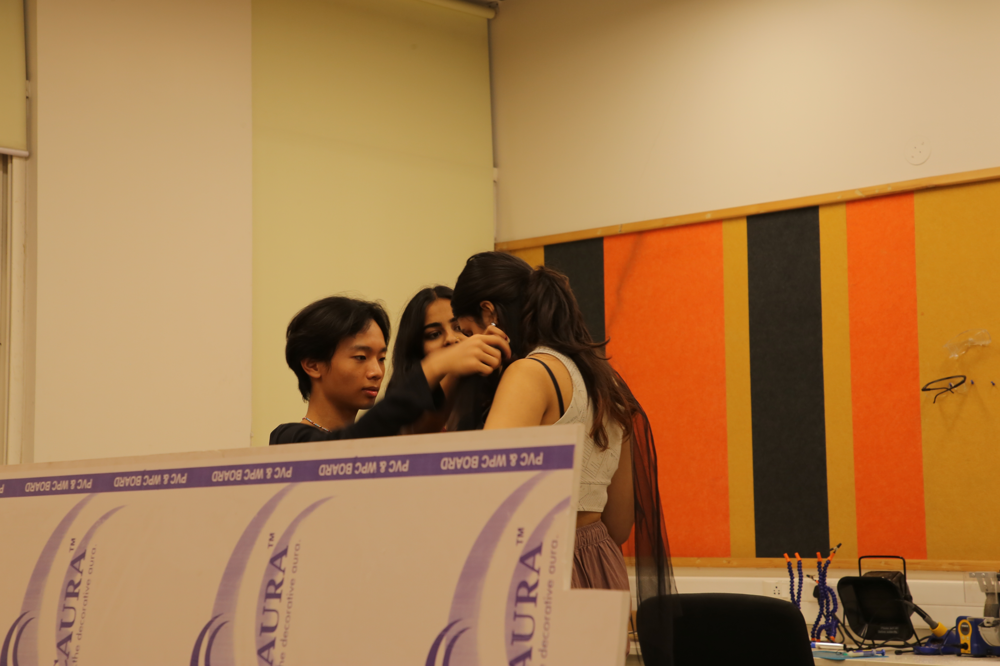

## The Ashokan Makerspace

The Ashoka Makerspace is wonderland, fantasy theme park for craft kind what is in the bulb, art, tech, science nerds coded. It is a place built with love and joy and passion for the idea and philosophy of a Makerspace and what it should be. While the machines and the materials are not the thing that make the thing so great, but the people, the stuff is really cool (it's also kind of the stuff). Here is a list and some pictures for your pleasure!

**3D Printing**
- Voron 2.4
- Ender 3
- Ender 6
- SLA 3D Printer (Formlabs Form 4L)
- SLS 3D Printer (Formlabs Fuse 1)

**Cutting & Machining**
- Laser Cutter (Trotec Speedy 400 Flexx)
- CNC Machine (Mehta CNC FX 1325V, 1300 x 2500 x 200 mm work area, 6KW air cooled 18,000 RPM spindle)
- Table-top Vinyl Cutter (Cricut Maker 3)

**Wood Workshop**
- Band Saw (Felder FB610)
- Panel Saw (Felder K350C)
- Mitre Saw
- Hand Tools

**Textile & Sewing**
- Sewing Machines (Usha Janome Dream Maker 120)
- Lockstitch Machine (Bernette Funlock B44)
- Embroidery Machine (Brother Innovis v3)
- Fabric Workstation

**Electronics**
- Oscilloscopes
- Function Generators
- SMD Rework Station
- Hot Plates
- Soldering Stations
- Soldering Microscopes
- Electronics Workstation

**Other Equipment**
- 3D Depth Camera
- Recording Equipment
- Projectors (4K 3500 lumens, 1080p 6500 lumens) for projection mapping

**Space**
- 4,500 sqft facility

